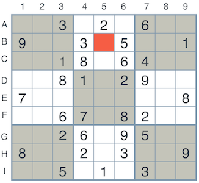
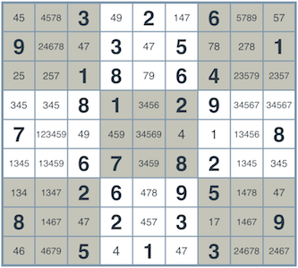
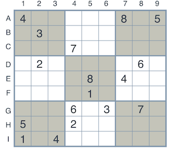

# Sudoku Solver

## Project summary and goals

The main goal of this project is to build an intelligent agent that will solve sudoku by  using two powerful techniques in the field of AI: constraint propagation and search

## Step 1: setting up the board
### Naming Conventions
#### Rows and Columns

Since we're writing an agent to solve the Sudoku puzzle, let's start by labelling rows and columns.

* The rows will be labelled by the letters A, B, C, D, E, F, G, H, I.
* The columns will be labelled by the numbers 1, 2, 3, 4, 5, 6, 7, 8, 9. Here we can see the unsolved and solved puzzles with the labels for the rows and columns.
* The 3x3 squares won't be labelled, but in the diagram, they can be seen with alternating colors of grey and white.


### Boxes, Units and Peers

And let's start naming the important elements created by these rows and columns that are relevant to solving a Sudoku:

* The individual squares at the intersection of rows and columns will be called `boxes`. These boxes will have labels 'A1', 'A2', ..., 'I9'.
* The complete rows, columns, and 3x3 squares, will be called `units`. Thus, each unit is a set of 9 boxes, and there are 27 units in total.
* For a particular box (such as 'A1'), its `peers` will be all other boxes that belong to a common unit (namely, those that belong to the same row, column, or 3x3 square).
Let's see an example. In the grids below, the set of highlighted boxes represent units. Each grid shows a different peer of the box at E3.


## Step 2: Encoding the board

Now, in order to implement an agent, let's start by coding the board in Python. Then, we'll code the necessary functions to solve the Sudoku. We'll record the puzzles in two ways — as a `string` and as a `dictionary`.

The string will consist of a concatenation of all the readings of the digits in the rows, taking the rows from top to bottom. If the puzzle is not solved, we can use a . as a placeholder for an empty box.

For example, the unsolved puzzle at the above left will be written as: 
..3.2.6..9..3.5..1..18.64....81.29..7.......8..67.82....26.95..8..2.3..9..5.1.3..

## Strategies to solve the puzzle
### Strategy 1: Elimination
First things first, let's look at a box on the left and analyze the values that could go in there.The possible values are 4 and 7. What did we do to figure this out? Well, all the other values already appear either in the same column, row, or 3x3 square of the highlighted box, so we conclude that they can't be a value for this box. In other words, we used the following strategy:

>**Strategy 1: Elimination
If a box has a value assigned, then none of the peers of this box can have this value.**
>

Now that we know how to eliminate values, we can take one pass, go over every box that has a value, and eliminate the values that can't appear on the box, based on its peers. Once we do so, the resulting box is shown on the right (for clarity, we've highlighted the original filled-in boxes in bold lettering)

 


### Strategy 2: Only Choice
After obtaining possible results obtained using elimination, let's actually look more carefully at the top 3x3 square in the center, highlighted in red. In this unit, since each digit must appear somewhere in the unit and there seems to be only one box which would allow a value of 1, we can conclude that the top right box must contain the digit 1.So, we have another strategy:

> **Strategy 2: Only Choice
If there is only one box in a unit which would allow a certain digit, then that box must be assigned that digit.**
>


If you've made it this far, you've already gained hands on exposure to a powerful technique in AI - **_Constraint Propagation_**. Constraint Propagation is all about using local constraints in a space (in the case of Sudoku, the constraints of each square) to dramatically reduce the search space. As we enforce each constraint, we see how it introduces new constraints for other parts of the board that can help us further reduce the number of possibilities. We can then apply the two aforementioned strategies to iteratively solve the sudoku puzzle as shown below:


### Strategy 3: Search
let's see if our algorithm will work all the time. Here's a harder sudoku puzzle shown on left and the resulting board after applying the algorithm on the right:

 

Clearly, the algorithm didn't solve it. It seemed to reduce every box to a number of possibilites, but it won't go farther than that. We need to think of other ways to improve our solution. We're now going to use another foundational AI technique to help us solve this problem: **_Search_**.Search is used throughout AI from Game-Playing to Route Planning to efficiently find solutions.

Here's how we'll apply it. For example, the box `A2` has four possibilities: 1, 6, 7, and 9. Why don't we fill it in with a 1 and try to solve our puzzle. If we can't solve it, we'll try with a 6, then with a 7, and then with a 9. Sure, it's four times as much work, but each one of the cases becomes easier.

Actually, there's something a bit smarter than that. Looking carefully at the puzzle, `G2`seems like the best one to pick in order to look at all its possibilities because it has the fewest numbers to try out.So it seems that we have a new strategy:

> **Strategy 3: Search
Pick a box with a minimal number of possible values. Try to solve each of the puzzles obtained by choosing each of these values, recursively.**
>

### Strategy 4: Naked Twins


# Question 1 (Naked Twins)
Q: How do we use constraint propagation to solve the naked twins problem?  
A: When we have 2 boxes in the same unit that allow the same 2 possibilities, we can conclude that no other boxes in the same unit can have those values. Therefore, the steps are: 

* Examine each unit and check for naked twins(pairs of length 2)
* If present then no other box in the unit can contain the 2 digits in each pair and remove the 2 digits from other unsolved peers in the unit.

Applying this rule reduces other boxes' possibilities and thus narrows down the solution space of the whole puzzle.


# Question 2 (Diagonal Sudoku)
Q: How do we use constraint propagation to solve the diagonal sudoku problem?  
A: Diagonal sudoku can be implemented by addition of two extra diagonal units to account for diagonal constraints. The same code will iterate through all the units, and the constraints would thus propagate. More specifically, all the diagonal entries will have the corresponding diagonal entries as their peers. This will result in not accepting solutions that do not satisfy the diagonal constraint. 


### Code

* `solution.py` - You'll fill this in as part of your solution.
* `solution_test.py` - Do not modify this. You can test your solution by running `python solution_test.py`.
* `PySudoku.py` - Do not modify this. This is code for visualizing your solution.
* `visualize.py` - Do not modify this. This is code for visualizing your solution.

### Visualizing

To visualize your solution, please only assign values to the values_dict using the ```assign_values``` function provided in solution.py

